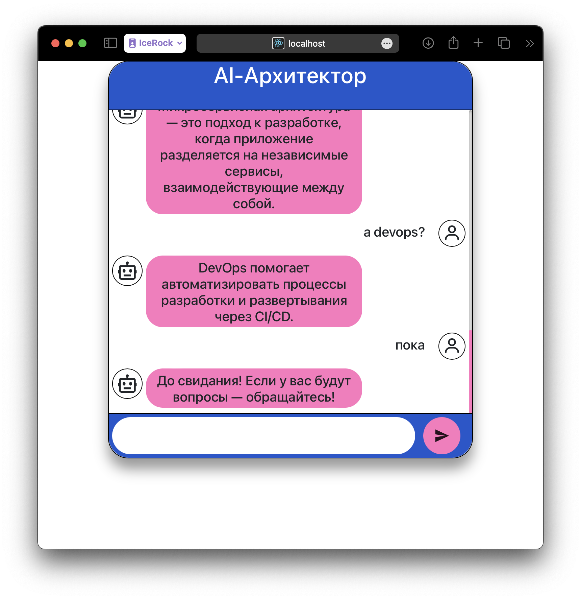

# Запуск и проверка

```
docker compose up
```

далее по адресу http://localhost:8080 будет чат доступен.

В [файле](rasa-chat.log) доступен лог работы RASA при небольшом диалоге со скриншота ниже.



# Обучение модели

Сначала собрать сборку с поддержкой Apple Silicon:
```
./build-rasa-apple.sh
```

Далее запускаем для работы CLI:
```
./rasa-cli.sh
```
Далее:
```
# переходим в рабочую директорию
cd /rasa-home

# тренируем модель
rasa train
```

# Ссылки
Офф док про докер - https://rasa.com/docs/rasa/docker/building-in-docker/

Проблематика про Apple Silicon - https://forum.rasa.com/t/cannot-run-rasa-with-docker-on-a-mac-m1/59121

Рабочий, но старый образ - https://github.com/khalo-sa/rasa-apple-silicon
